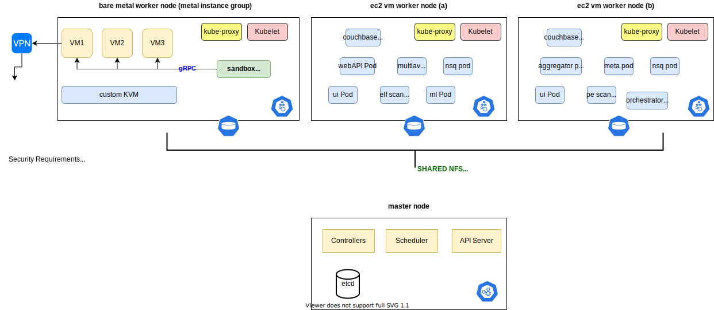

# Architecture

This document describes the high-level architecture of saferwall. If you want to familiarize yourself with the architecture base, you are just in the right place!

## KVM Nodes

- The malware detonation service runs on bare metal linux nodes that hosts KVM. We call them `kvm-nodes`.
- Each kvm-node is part of the kubernetes cluster, they belong to the same kubernetes `instance group`.
- Each kvm-node runs a daemonset that manages the virtual machines running inside KVM.