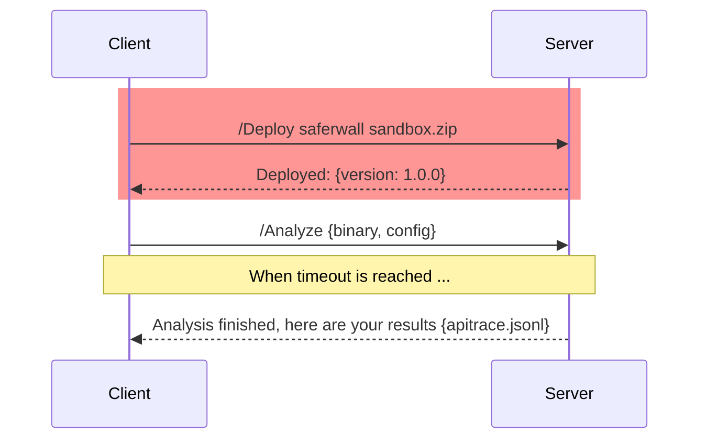

# Sandbox

## Agent client-server communication

- gRPC client/server app to bootstrap a binary sample for the malware sandbox analysis.

## Workflow

- Find a free VM
- Make an RPC `/deploy` packages.
- Make an RPC `/analyze` sample.
- Wait for the given timeout until results come back.
- Process the results:
    - Convert the APIs trace log and the sandbox log from jsonl to json.
    - Go over screenshots, generate thumbs and upload them.
    - Go over artifacts+dumps, yara scan them and upload the results.

## References

- https://access.redhat.com/solutions/732773
- https://www.redhat.com/en/blog/introduction-virtio-networking-and-vhost-net
